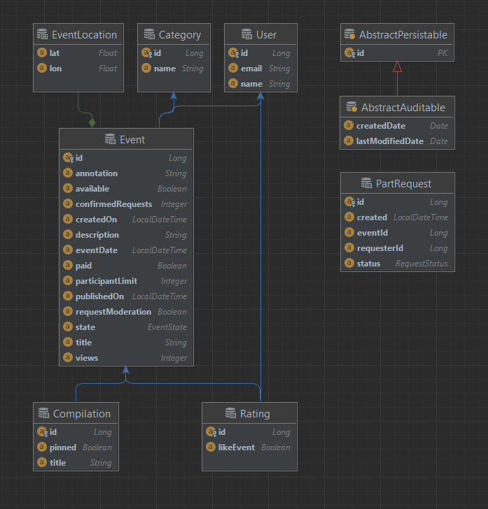
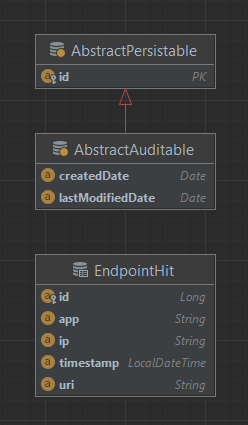

# Приложение — афиша
### В этой афише можно предложить какое-либо событие от выставки до похода в кино и собрать компанию для участия в нём.

## Два сервиса
 - ***Основной сервис***  содержит всё необходимое для работы продукта  
 - ***Сервис статистики*** хранит количество просмотров и позволяет делать различные выборки для анализа работы приложения.

## Основной сервис
### API основного сервиса разделены на три части:
- ***административная*** для администраторов сервиса.
- ***закрытая*** будет доступна только авторизованным пользователям;
- ***публичная*** будет доступна без регистрации любому пользователю сети;

### API для администратора
#### Административная часть API предоставляет возможность настройки и поддержки работы сервиса:
 - добавление, изменение и удаление категорий для событий;
 - возможность добавлять, удалять и закреплять на главной странице подборки мероприятий; 
 - модерация событий, размещённых пользователями, — публикация или отклонение; 
 - управление пользователями — добавление, активация, просмотр и удаление.

### API для авторизованных пользователей
#### Закрытая часть API реализует возможность зарегистрированных пользователей продукта:
 - авторизованные пользователи имеют возможность добавлять в приложение новые мероприятия, редактировать их и просматривать после добавления;
 - подача заявок на участие в интересующих мероприятиях;
 - создатель мероприятия имеет возможность подтверждать заявки, которые отправили другие пользователи сервиса.

## Модель данных
### Жизненный цикл события включает несколько этапов.
 - Создание;
 - Ожидание публикации. В статус ожидания публикации событие переходит сразу после создания; 
 - Публикация. В это состояние событие переводит администратор;
 - Отмена публикации. В это состояние событие переходит в двух случаях. 
   - Первый — если администратор решил, что его нельзя публиковать. 
   - Второй — когда инициатор события решил отменить его на этапе ожидания публикации.

## Сервис статистики
#### Второй сервис — сервис статистики. Он собирает информацию. 
 - количество обращений пользователей к спискам событий; 
 - количество запросов к подробной информации о событии. На основе этой информации формироваться статистика о работе приложения.

## Схема базы данных основного сервиса([API](ewm-main-service-spec.json)- основного сервиса, [API](feature-rating-events-spec.json) - рейтинга):

## Схема базы данных сервиса статистика([API](ewm-stats-service-spec.json)):

Подходы и технологии: [Микро сервисная архитектура](https://microservices.io/index.html), [Spring Boot](https://spring.io/projects/spring-boot), [PostgreSQL](https://www.postgresql.org/), [Docker](https://www.docker.com/).  
